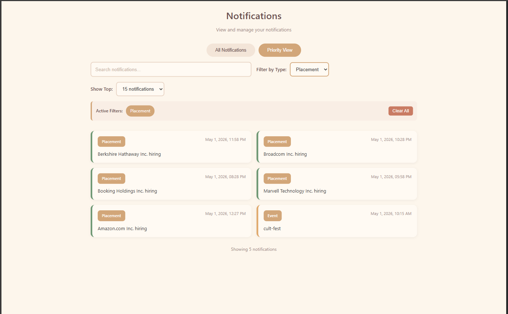
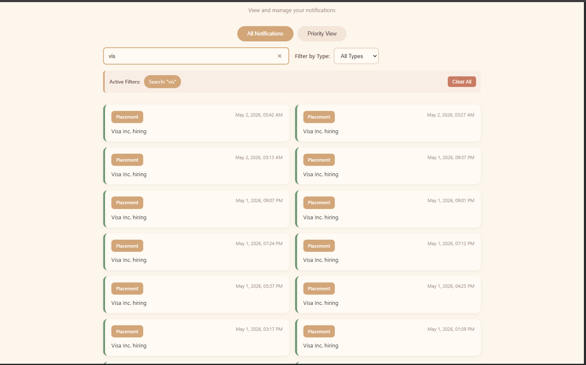
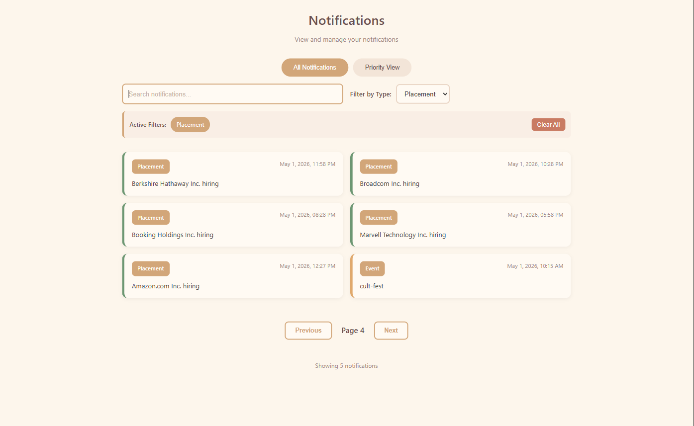
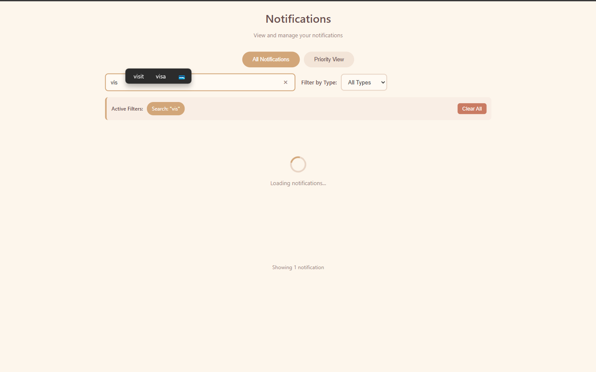
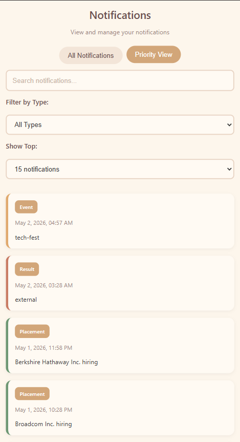
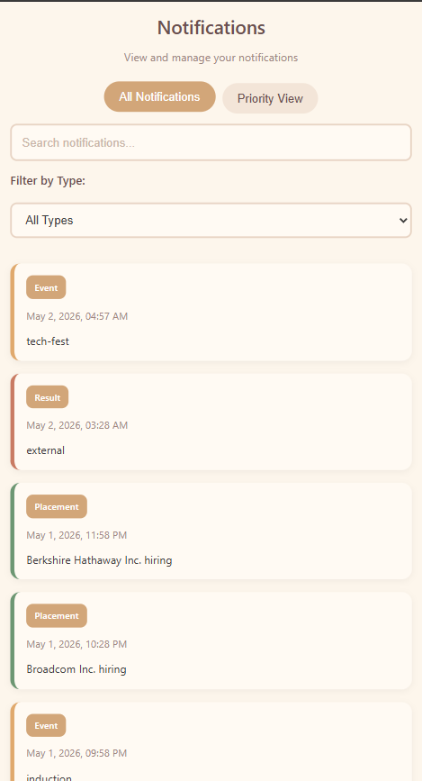
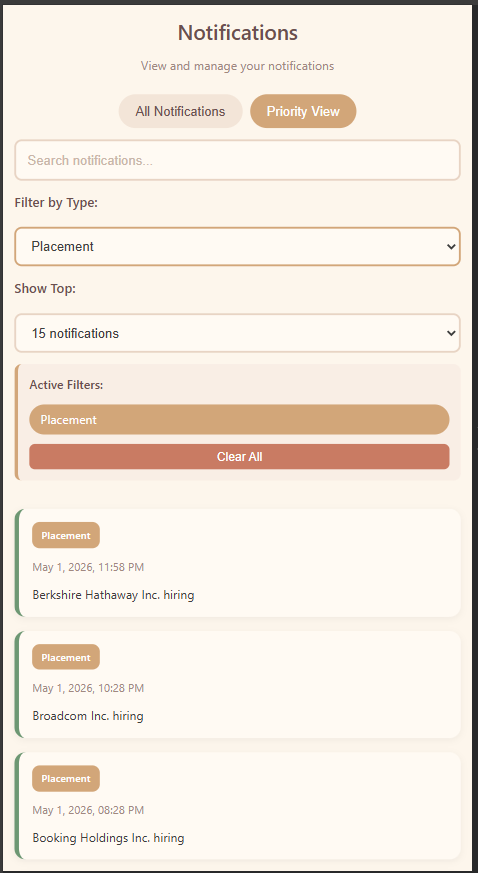

# Notification Management System

A high-performance, professional React-based notification dashboard designed for seamless interaction. This system allows users to efficiently manage, filter, and search through large volumes of notifications with a modern, responsive interface.

## 🚀 Key Features

- **Dynamic Pagination**: Smooth navigation through paginated API data.
- **Smart Search**: Debounced search (500ms) to reduce API overhead while providing instant feedback.
- **Advanced Filtering**: Categorize notifications by type (Placement, Event, Result).
- **Priority View**: Quick access to the most recent critical updates with customizable view limits.
- **Responsive Design**: Optimized experience across Desktop and Mobile devices.
- **Real-time UX**: Loading states, empty states, and interaction logging for better usability.

## 📸 Project Screenshots

### Desktop Experience

| Feature | Screenshot |
|---------|------------|
| **Priority View** |  |
| **Filtered Search** |  |
| **Active Filters** |  |
| **Loading State** |  |

### Mobile Experience

| Feature | Screenshot |
|---------|------------|
| **Priority View** |  |
| **All Notifications** |  |
| **Mobile Priority Filter** |  |

## 🛠️ Technology Stack

- **Frontend**: React 18, Vite, Axios
- **Styling**: Vanilla CSS (Responsive, Modern UI)
- **Backend**: Node.js REST API (JWT Authenticated)
- **Tooling**: ESLint, Prettier

## 📂 Project Structure

```
.
├── notification_app_fe/      # React Frontend Application
│   ├── src/                  # Source code (Components, Hooks, Services)
│   ├── output/               # UI Screenshots & Documentation Assets
│   └── ...
├── notification_app_be/      # Node.js Backend API
├── logging_middleware/       # Custom logging logic
└── notification_system_design.md  # Detailed System Documentation
```

## ⚙️ Setup Instructions

### Frontend Setup
1. Navigate to the frontend directory:
   ```bash
   cd notification_app_fe
   ```
2. Install dependencies:
   ```bash
   npm install
   ```
3. Configure environment variables in `.env`:
   ```env
   VITE_API_BASE=http://your-api-url.com
   VITE_ACCESS_TOKEN=your-jwt-token-here
   ```
4. Start the development server:
   ```bash
   npm run dev
   ```

## 📝 License

This project is developed as part of a high-end notification system implementation.
